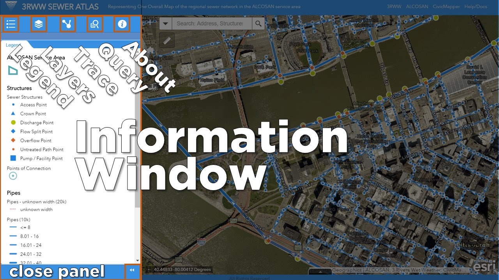

# The Sewer Atlas **Interface**

The application's interface is comprised of two main components:

* **Map Window:** The right side of the interface displays the map. Tools for navigating and interacting with the map and data overlay the map.

* **Information Window:** The left side of the interface displays information about the map or widgets used to interact with the data. The Information Window can be collapsed by clicking the close arrows ("<<") at the bottom of the window.

## Map Window

*Above: elements of the the Sewer Atlas interface Map Window*

By default, drag the map to pan; use a scroll wheel if available to zoom.
Clicking on wastewater pipes and structures will reveal a pop-up window containing more information about the infrastructure.

Three buttons located in the top left corner of the map window provide additional control:

* **Zoom** buttons zoom the map near and far.

* The **Home** button resets the map to its inital zoom and location

* The **My Location** button will set the map to your location, if your browser and/or device has the necessary geo-location capabilities enabled. These capabilities vary by device.

Adjacent to the **Zoom**, **Home**, and **My Location** buttons is a **Search Box**. See [Searching for Locations](help_rsi_tasks.md#searching-for-locations) for mor information.

Two widgets are located at the bottom of the window:

* the coordinates of the map cursor, reported as longitude and latitude (X and Y) in decimal degrees. See [Identifying Coordinates](help_rsi_tasks.md#identifying-coordinates) for more information.

* a tab, which when clicked will reveal the **Attribute Table**. See [Using the Attribute Table](help_rsi_tasks.md#using-the-attribute-table) for more information.

Three widgets are located in the top-right corner of the map window:

### *Measure*

This widget allows you to quickly measure distance and/or area on the map. Select the `Area` or `Distance` button in the widget, and then click on the map at desired locations. The length or area of the drawing will be displayed in the widget.

This tool will also identify the longitude and latitude (X and Y) of a point placed on the map. See [Identifying Coordinates](help_rsi_tasks.md#identifying-coordinates) for more information.

### *Print*

This widget allows you to print your current map view to a `.pdf` or one of several image formats.

## Information Window

*Above: elements of the the Sewer Atlas interface Information Window*

The left side of the screen contains a collapsible window that displays several types of information and/or options for configuring the map. Along the top of this window you can find icons for the following 'widgets':

### *Legend*
Summarizes the symbols for features currently shown on the map. This window will change dynamically depending on the layers shown on the map.

### *Map Layers*
Shows all data layers available for viewing on the map, and allows the user to select layers See [Changing Map Layers](help_rsi_tasks.md#changing-map-layers) for more information.

### *Network Trace*
Opens the Network Trace tool. See [Tracing the Wastewater Network](help_rsi_tasks.md#tracing-the-wastewater-network) below for more information.

### *Query*
(under the **More** icon) Provides the ability to select features from the sewer data. See [Selecting/Highlighting Features](help_rsi_tasks.md#selectinghighlighting-features) for more information.

### *Basemap Gallery*
(under the **More** icon) Displays Available basemaps for display underneath the Map Layers. See
[Changing Basemaps](help_rsi_tasks.md#changing-basemaps) for more information.

### *About*
(under the **More** icon) Provides an introduction to the application.

 
 
 

This documentation draws heavily from ArcGIS Online documentation: [Overview-Web AppBuilder for ArcGIS - Create Apps - Widget Overview](http://doc.arcgis.com/en/web-appbuilder/create-apps/widget-overview.htm). Accessed September 2015. Source documentation © Copyright 2015 Environmental Systems Research Institute, Inc.
